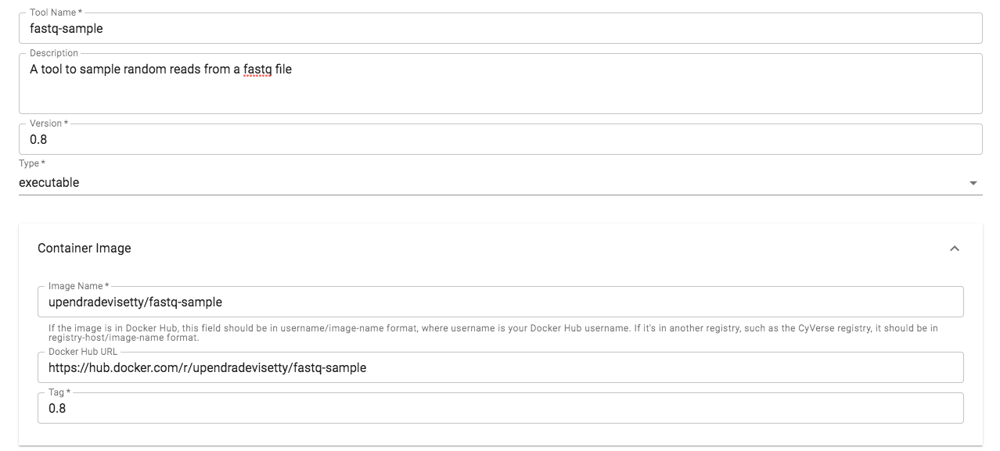

.. include:: cyverse_rst_defined_substitutions.txt

|CyVerse logo|_

|Home_Icon|_
`Learning Center Home <http://learning.cyverse.org/>`_

**Tool Integration in DE**
==========================

Tool integration in CyVerse `Discovery Environment <https://de.cyverse.org/>`_ can be done either for executable tool (includes osg) or interactive tool.

.. toctree::
        :maxdepth: 1

        Executable Tools <self>
        Open-Science-Grid (OSG) Tools <osg.rst>
        Interactive Tools (VICE) Tools <interacative.rst>

Goal
----

This 3-step quickstart allows users to integrate the Docker images of their favorite software as **executable** tool type in DE. If users are interested in integrating the Docker images of their favorite software as **osg** or **interactive**, please refer to here and here respectively. 

.. Important::

  What is executable software/tool?

  Any software/tool that can be run on the command line without the need to open any ports

-----

Prerequisites
-------------

Downloads, access, and services
~~~~~~~~~~~~~~~~~~~~~~~~~~~~~~~

*In order to complete this tutorial you will need access to the following services/software*

 .. list-table::
   :header-rows: 1

   * - Prerequisite
     - Preparation/Notes
     - Link/Download
   * - CyVerse account
     - You will need a CyVerse account to complete this exercise
     - |CyVerse User Portal|

Platform(s)
~~~~~~~~~~~

*We will use the following CyVerse platform(s):*

 ..
   #### comment: delete any row not needed in this table ####

.. list-table::
    :header-rows: 1

    * - Platform
      - Interface
      - Link
      - Platform Documentation
      - Quick Start
    * - Discovery Environment
      - Web/Point-and-click
      - |Discovery Environment|
      - |DE Manual|
      - |Discovery Environment Guide|
  
Input and example data
~~~~~~~~~~~~~~~~~~~~~~

*In order to complete this quickstart you will need to have the following inputs prepared*

.. list-table::
    :header-rows: 1

    * - Input File(s)
      - Format
      - Preparation/Notes
      - Example Data
    * - Read1.fastq
      - fastq
      - Make sure it is a fastq file and not fasta file
      - Read1.fastq

----

Get started
===========

- Find the Docker image of your tool/software of your interest
- Test the Docker image with the test data
- Add tool in CyVerse Discovery Environment

1. Find the Docker image

We will use `fastq-sample <https://homes.cs.washington.edu/~dcjones/fastq-tools/fastq-sample.html>`_ for integrating as tool in DE. Fortunately, there is Docker image available for `fastq-sample` on Dockerhub and so we can use that `fastq-sample docker image <https://hub.docker.com/r/upendradevisetty/fastq-sample>`_ for integrating that as tool in DE.

.. Note::

  If there is no Docker image available for your tool of interest, then you would either find a Dockerfile which you can use to build the Docker image for your tool of interest or create one. You can get more help with either of that from `here <https://learning.cyverse.org/projects/container_camp_workshop_2019/en/latest>`_

2. Test the Docker image locally on your computer (Optional but recommended)

This is optional but highly recommended step to confirm that the Docker image for your tool of interest is working as expected. Here is how you would test `fastq-sample <https://homes.cs.washington.edu/~dcjones/fastq-tools/fastq-sample.html>`_ with the intructions they provided in their README

2.1 Pull the image from Dockerhub

.. code-block:: bash

  $ docker pull upendradevisetty/fastq-sample:0.8

2.2 See the command line help for the image

.. code-block:: bash

  $ docker run upendradevisetty/fastq-sample:0.8 -h
    fastq-sample [OPTION]... FILE [FILE2]
    Sample random reads from a FASTQ file.Options:
    -n N                    the number of reads to sample (default: 10000)
    -p N                    the proportion of the total reads to sample
    -o, --output=PREFIX     output file prefix
   (Default: "sample")  -c, --complement-output=PREFIX
                            output reads not included in the random sample to
                            a file (or files) with the given prefix (by default,
                            they are not output).
    -r, --with-replacement  sample with replacement
    -s, --seed=SEED         a manual seed to the random number generator
    -h, --help              print this message
    -V, --version           output version information and exit

2.3 Sample run with an example file

.. code-block:: bash

  $ docker run --rm -u $(id -u):$(id -g) -v $PWD:/data -w /data upendradevisetty/fastq-sample:0.8 -n 10 Read1.fastq

Once you get the expected output, then you are ready for the next step

3. Add tool in CyVerse Discovery Environment

Now that the `fastq-sample` Docker image has been tested, it is now ready to be integrated into DE. 

3.1 Log-in to CyVerse Discovery Environment and click on the "Apps" window

3.2 Click "Manage Tools" -> "Tools" -> "Add Tool" and fill the details about your Docker image

.. code-block::bash

  Tool-Name: fastq-sample
  Description: A tool to sample random reads from a fastq file
  Version: 0.8
  Type: executable
  Image Name: upendradevisetty/fastq-sample
  Docker Hub URL: https://hub.docker.com/r/upendradevisetty/fastq-sample
  Tag: 0.8

|add_tool|

3.3 Procede to create an app in Discovery Environment

The next step is the

----

Additional information, help
~~~~~~~~~~~~~~~~~~~~~~~~~~~~

Search for an answer:
|CyVerse Learning Center| or
|CyVerse Wiki|

Post your question using the intercom button on the bottom right of this page:

----

**Fix or improve this documentation**

- On Github: |Github Repo Link|
- Send feedback: `Tutorials@CyVerse.org <Tutorials@CyVerse.org>`_

----

|Home_Icon|_
`Learning Center Home <http://learning.cyverse.org/>`__

.. |Github Repo Link|  raw:: html

   <a href="https://github.com/CyVerse-learning-materials/DE-tool-integration-quickstart" target="blank">Github Repo Link</a>

