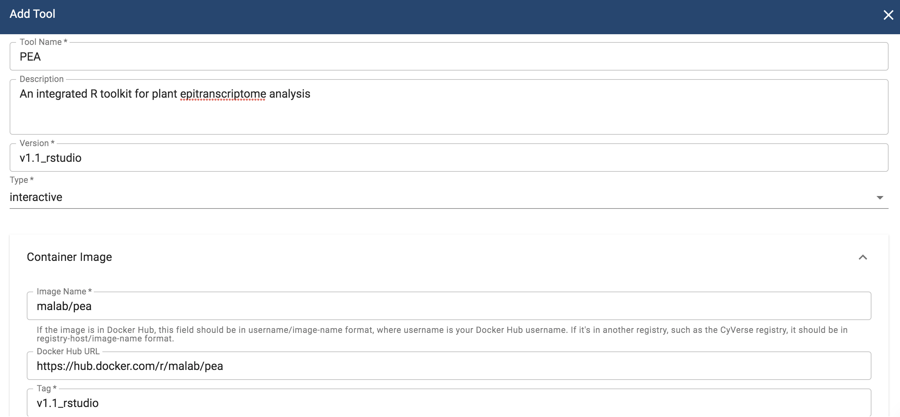
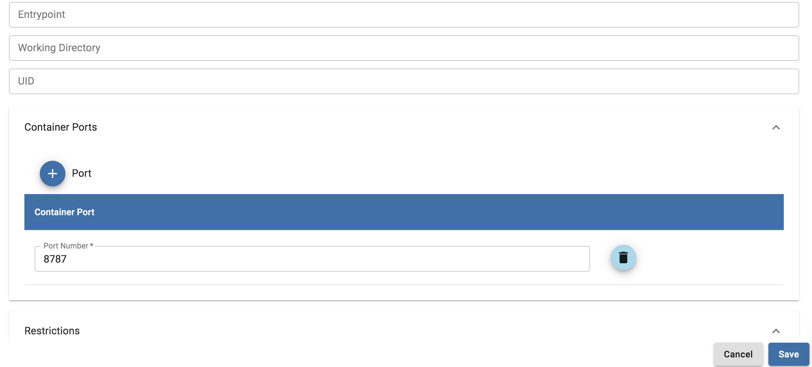

.. include:: cyverse_rst_defined_substitutions.txt

|CyVerse_logo|_

|Home_Icon|_
`Learning Center Home <http://learning.cyverse.org/>`_

**Interactive (VICE) Tool Integration in DE**
=============================================

Goal
----

This quickstart contains the complete instructions for integrating interactive (VICE) tools in DE which is mainly intended for exploratory data analysis (bioinformatic and geoinformatic) as well as the ability to run ad-hoc scripts.

.. Tip::

  What is interactive tool?

  Any tool that needs to run on the web browser by opening up ports is considered as an interactive tool

For more information on Interactive tools, please refer to this extensive `documentation <https://learning.cyverse.org/projects/vice/en/latest/index.html>`_

-----

Prerequisites
-------------

Downloads, access, and services
~~~~~~~~~~~~~~~~~~~~~~~~~~~~~~~

*In order to complete this tutorial you will need access to the following services/software*

 .. list-table::
   :header-rows: 1

   * - Prerequisite
     - Preparation/Notes
     - Link/Download
   * - CyVerse account
     - You will need a CyVerse account to complete this exercise
     - |CyVerse User Portal|

Platform(s)
~~~~~~~~~~~

*We will use the following CyVerse platform(s):*

 ..
   #### comment: delete any row not needed in this table ####

.. list-table::
    :header-rows: 1

    * - Platform
      - Interface
      - Link
      - Platform Documentation
      - Quick Start
    * - Discovery Environment
      - Web/Point-and-click
      - |Discovery Environment|
      - |DE Manual|
      - |Discovery Environment Guide|

----

Get started
-----------

- Find the Docker image of your interactive tool/software of your interest
- Test the Docker image 
- Add the interactive tool in CyVerse Discovery Environment

1. Find the Docker image

We will use `PEA-Rstudio <https://github.com/cma2015/PEA>`_, an integrated R toolkit for epitranscriptome analysis for integrating as an interactive tool in DE. Fortunately, there is Docker image available for `PEA` on `Dockerhub <https://hub.docker.com/r/malab/pea>`_ for integrating that as an interactive tool in DE.

.. Note::

  If there is no Docker image available for your tool of interest, then you would either find a Dockerfile which you can use to build the Docker image for your tool of interest or create one. You can get more help with either of that from `here <https://learning.cyverse.org/projects/container_camp_workshop_2019/en/latest>`_

2. Test the Docker image locally on your computer (Optional but recommended)

This is optional but highly recommended step to confirm that the Docker image for your tool of interest is working as expected. Here is how you would test `PEA <https://github.com/cma2015/PEA/blob/master/tutorial/PEA_installation_and_quickly_start.md>`_ with the intructions they provided in their README

2.1 Pull the image from Dockerhub

.. code-block:: bash

  $ docker pull malab/pea:v1.1_rstudio

.. Note::

If you are looking for a place to pull the Docker image or run the Docker container, then you can use the free resource - `Play with Docker <https://labs.play-with-docker.com/>`_

2.2 Sample run 

Once PEA-Rstudio Docker image is pulled successfully, type the following command to start PEA

.. code-block:: bash

  $ docker run --rm -d -p 8787:8787 malab/pea:v1.1_rstudio

.. Note::

  The username and password for Rstudio is ``rstudio`` and ``pea`` respectively

Once you can open the Rstudio, then you are ready to integrate the tool in DE

3. Add tool in CyVerse Discovery Environment

Now that the PEA-Rstudio Docker image has been tested, it is now ready to be integrated into DE. 

3.1 Log-in to CyVerse Discovery Environment and click on the "Apps" window

3.2 Click "Manage Tools" -> "Tools" -> "Add Tool" and fill the details about your Docker image

.. code-block::bash

  Tool-Name: PEA
  Description: PEA: an integrated R toolkit for epitranscriptome analysis
  Version: v1.1_rstudio
  Type: interactive
  Image Name: mlab/pea
  Docker Hub URL: https://hub.docker.com/r/malab/pea
  Tag: v1.1_rstudio

|add_tool_int_1|

|add_tool_int_2|

Procede `here <https://wiki.cyverse.org/wiki/display/DEmanual/Designing+the+Interface>`_ to create an app interface in the CyVerse Discovery Environment

----

Additional information, help
~~~~~~~~~~~~~~~~~~~~~~~~~~~~

Post your question using the intercom button on the bottom right of this page:

----

**Fix or improve this documentation**

- Search for an answer:
  |CyVerse Learning Center|
- Ask us for help:
  click |Intercom| on the lower right-hand side of the page
- Report an issue or submit a change:
  |Github Repo Link|
- Send feedback: `Tutorials@CyVerse.org <Tutorials@CyVerse.org>`_

----

|Home_Icon|_
`Learning Center Home <http://learning.cyverse.org/>`__

.. |Github Repo Link|  raw:: html

   <a href="https://github.com/CyVerse-learning-materials/DE-tool-integration-quickstart" target="blank">Github Repo Link</a>

