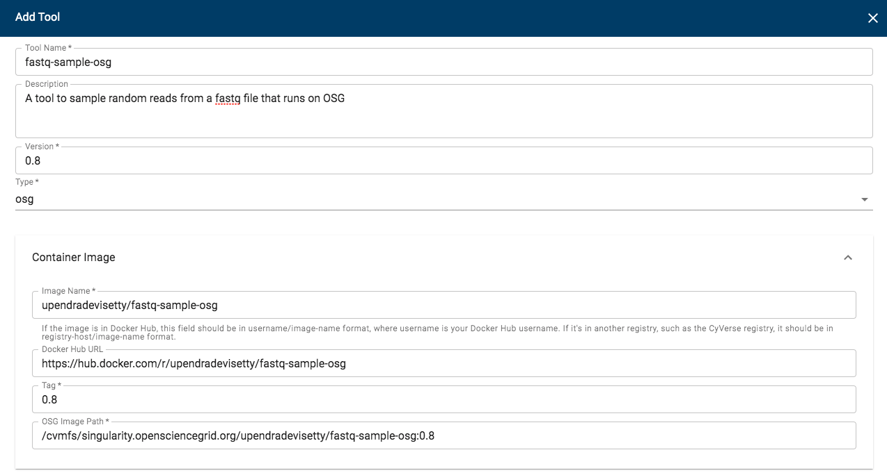
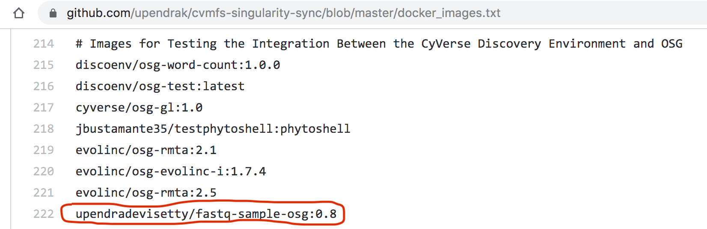

.. include:: cyverse_rst_defined_substitutions.txt

|CyVerse logo|_

|Home_Icon|_
`Learning Center Home <http://learning.cyverse.org/>`_

**OSG Tool Integration in DE**
==============================

Goal
----

This quickstart contains the complete instructions for integrating osg tools in DE which is mainly intended for high-throughput processing

.. Important::

  What is osg tool?

  Any software/tool that can be run on the command line without the need to open any ports

-----

Prerequisites
-------------

Downloads, access, and services
~~~~~~~~~~~~~~~~~~~~~~~~~~~~~~~

*In order to complete this tutorial you will need access to the following services/software*

 .. list-table::
   :header-rows: 1

   * - Prerequisite
     - Preparation/Notes
     - Link/Download
   * - CyVerse account
     - You will need a CyVerse account to complete this exercise
     - |CyVerse User Portal|

Platform(s)
~~~~~~~~~~~

*We will use the following CyVerse platform(s):*

 ..
   #### comment: delete any row not needed in this table ####

.. list-table::
    :header-rows: 1

    * - Platform
      - Interface
      - Link
      - Platform Documentation
      - Quick Start
    * - Discovery Environment
      - Web/Point-and-click
      - |Discovery Environment|
      - |DE Manual|
      - |Discovery Environment Guide|
  
Input and example data
~~~~~~~~~~~~~~~~~~~~~~

*In order to complete this quickstart you will need to have the following inputs prepared*

.. list-table::
    :header-rows: 1

    * - Input File(s)
      - Format
      - Preparation/Notes
      - Example Data
    * - Read1.fastq
      - fastq
      - Make sure it is a fastq file and not fasta file
      - Read1.fastq

----

Get started
-----------

- Create a Docker image for your tool/software of interest

- Build the Docker image for your tool/software

- Test Docker image

- Submit a pull request to OSG github repo

- Integrate DE tool using “Add Tools” option in DE

1. Create a Docker image for your tool
~~~~~~~~~~~~~~~~~~~~~~~~~~~~~~~~~~~~~~

This is the first step in the process of making OSG tool integration in DE. The minimum requirements for creating a Docker image include the following dependencies (apart from the dependencies that are needed for your tool of interest)

1.1 Ubuntu Operating system (preferred 16.04 and beyond)

1.2 Directories named `cvmfs` `work`

1.3 iRODS icommands version 4.0 or above.

1.4 An executable `wrapper` script

1.5 An upload file `upload-files` at `/usr/bin` in the container

We will use `fastq-sample <https://homes.cs.washington.edu/~dcjones/fastq-tools/fastq-sample.html>`_ for integrating as OSG-tool in DE. Let's first create a Dockerfile using your favorite editor which satisfies the above requirements

.. code-block:: bash
  
  $ mkdir fastq-sample-osg && cd fastq-sample-osg

  $ wget https://raw.githubusercontent.com/upendrak/fastq-sample-osg/master/upload-files

  $ wget https://raw.githubusercontent.com/upendrak/fastq-sample-osg/master/wrapper

.. code-block:: bash

  $ vi Dockerfile

  FROM ubuntu:xenial
  MAINTAINER Upendra Devisetty <upendra@cyverse.org>

  RUN mkdir /cvmfs /work

  RUN apt-get update \
      && apt-get install -y lsb curl apt-transport-https python3 python-requests libfuse2 wget gcc make libpcre3-dev libz-dev 

  # Install fastq-tools
  RUN wget http://homes.cs.washington.edu/~dcjones/fastq-tools/fastq-tools-0.8.tar.gz
  RUN tar xvf fastq-tools-0.8.tar.gz
  WORKDIR fastq-tools-0.8
  RUN ./configure
  RUN  make install fastq==0.8

  WORKDIR /work

  # Define the iRODS package.
  ENV ICMD_BASE="https://files.renci.org/pub/irods/releases/4.1.10/ubuntu14"
  ENV ICMD_PKG="irods-icommands-4.1.10-ubuntu14-x86_64.deb"

  # Install icommands.
  RUN curl -o "$ICMD_PKG" "$ICMD_BASE/$ICMD_PKG" \
          && dpkg -i "$ICMD_PKG" \
          && rm -f "$ICMD_PKG"

  # Install the wrapper script and the script to upload the output files.
  ADD wrapper /usr/bin/wrapper
  ADD upload-files /usr/bin/upload-files

  # Make the wrapper script the default command.
  CMD ["wrapper"]

.. Note::

  The ``Dockerfile`` and ``wrapper`` files are specific for ``fastq-sample`` tool. If you want to create OSG tool for your tool of interest, replace the specific parts of the scripts

2. Build and push the Docker image to Dockerhub
~~~~~~~~~~~~~~~~~~~~~~~~~~~~~~~~~~~~~~~~~~~~~~~

Once you create the Dockerfile, next step is to build the Docker image and push it to Dockerhub manually (you can also do an `automated build <https://learning.cyverse.org/projects/container_camp_workshop_2019/en/latest/docker/dockeradvanced.html#automated-docker-image-building-from-github>`_)

.. code-block:: bash

   $ docker build -t upendradevisetty/fastq-sample-osg:0.8 .

   $ docker push upendradevisetty/fastq-sample-osg:0.8

3. Test Docker image
~~~~~~~~~~~~~~~~~~~~~

Testing of OSG-fastq-sample docker image can be done in two ways: Locally using Singularity and on Open Science Grid (OSG). Since many users don't have access to OSG, we recommed that you test it locally. 

.. Important::
  
  This is very important step as it is very hard to troubleshoot after you integrate the OSG tool in DE

3.1 Create a folder with input file(s) and output folder on CyVerse Datastore

For this example, the only input file is `Read1.fastq`. I have this input file in this path on Datastore `/iplant/home/upendra_35/fastq-sample-osg/Read1.fastq` and output folder in this path on Datastore `/iplant/home/upendra_35/fastq-sample-osg/output`

3.2 Create input and output path files

The next step is to create an input and output path files that contains the paths to the input and output respectively. 

.. code-block:: bash

  $ cat input-paths.txt 
    /iplant/home/upendra_35/fastq-sample-osg/Read1.fastq

  $ cat output-paths.txt 
    /iplant/home/upendra_35/fastq-sample-osg/output

3.3 Create input and output tickets from input and output paths files

Using `create-tickets.sh <https://github.com/upendrak/fastq-sample-osg/blob/master/create-tickets.sh>`, create tickets for both inputs and outputs

.. code-block:: bash

  $ wget https://raw.githubusercontent.com/upendrak/fastq-sample-osg/master/create-tickets.sh

  $ mkdir sample_data

  $ bash create-tickets.sh -r input-paths.txt > sample_data/input_ticket.list
  $ cat sample_data/input_ticket.list
    # application/vnd.de.path-list+csv; version=1
    c0837571b6b7416fb998c5b9b226ea,/iplant/home/upendra_35/fastq-sample-osg/Read1.fastq 

  $ bash create-tickets.sh -w output-paths.txt > sample_data/output_ticket.list
  $ cat sample_data/output_ticket.list
    # application/vnd.de.path-list+csv; version=1
    3fe4ea0dab5241cfb69420335c0902,/iplant/home/upendra_35/fastq-sample-osg/output 

3.4 Create a ``config.json`` file in the ``sample_data`` folder

Here is an example of ``config.json`` for the ``fastq-sample-osg`` tool

.. code-block:: bash

   $ vi sample_data/config.json 
    {
        "arguments": [
            "-n",
            "10",
      "Read1.fastq"
        ],
        "irods_host": "davos.cyverse.org",
        "irods_port": 1247,
        "irods_job_user": "upendra_35",
        "irods_user_name": "job",
        "irods_zone_name": "",
        "input_ticket_list": "input_ticket.list",
        "output_ticket_list": "output_ticket.list",
        "status_update_url": "https://de.cyverse.org/job/bd1a1b53-9a7e-4031-bf0c-227a0c63f555/status",
        "stdout": "out.txt",
        "stderr": "err.txt"
    }

This is similar to running on the commandline like this..

.. code-block:: bash

   $ fastq-sample -n 10 Read1.fastq

3.5 Pull the Docker image as singularity file (.sif)

.. Note::

  You need to have `Singularity <https://sylabs.io/guides/3.0/user-guide/installation.html>`_ installed first inorder to run this

.. code-block:: bash

   $ singularity pull docker://upendradevisetty/fastq-sample-osg:0.8

This will create `fastq-sample-osg_0.8.sif` singularity image in your working directory

3.6 Test the singularity image

Once you have the input, output tickets and config files created, you are ready for the test with Singularity image

.. Note::

   Before you run this, make sure that you remove the irods password in your system by running ``rm ~/.irods/.irodsA``

.. code-block:: bash

  $ cd sample_data

  $ singularity exec ../fastq-sample-osg_0.8.sif ../wrapper
    running: configuration successfully loaded
    running: initializing the iRODS connection
    running: downloading the input files
    Enter your current iRODS password:
    running: processing the input files
    running: uploading the output files
    Enter your current iRODS password:
    Enter your current iRODS password:Enter your current iRODS password:

    Enter your current iRODS password:
    Enter your current iRODS password:
    Enter your current iRODS password:Enter your current iRODS password:
    Enter your current iRODS password:Enter your current iRODS password:completed: job completed successfully

.. Note::

  It will prompt you to enter your irods passwords several times, if so, then keep pressing the ENTER until the job is successfully finished. The output files will be uploaded to your output folder in datastore.

Once your job has finished, you should expect to see the input (``Read1.fastq``) and output (``sample.fastq``) files in the current working directory and also in the in the output directory. 

.. code-block::bash

  $ ls

  $ ils /iplant/home/upendra_35/fastq-sample-osg/output
    /iplant/home/upendra_35/fastq-sample-osg/output:
      err.txt
      out.txt
      sample.fastq

4. Submit a pull request to OSG github repo for ``fastq-sample-osg`` tool
~~~~~~~~~~~~~~~~~~~~~~~~~~~~~~~~~~~~~~~~~~~~~~~~~~~~~~~~~~~~~~~~~~~~~~~~~

Once the Singularity run works, add your Docker image in `here <https://github.com/opensciencegrid/cvmfs-singularity-sync/blob/master/docker_images.txt>`_. For this particular example, we will add ``upendradevisetty/fastq-sample-osg:0.8`` in there.

.. Note::

  You will have to fork and do a PR for this to work

Here is a screenshot of ``fastq-sample-osg:0.8`` pull request to OSG github repo

|osg-cvmfs|

After the PR is merged, it takes few hours for the image to be available on CVMFS.

5. Integrate DE tool using “Add Tools” option in DE
~~~~~~~~~~~~~~~~~~~~~~~~~~~~~~~~~~~~~~~~~~~~~~~~~~~~

After the image is available on OSG, it is now ready to be integrated into DE. 

5.1 Log-in to CyVerse Discovery Environment and click on the "Apps" window

5.2 Click "Manage Tools" -> "Tools" -> "Add Tool" and fill the details about your Docker image

.. code-block::bash

  Tool-Name: fastq-sample-osg
  Description: A tool to sample random reads from a fastq file that runs on OSG
  Version: 0.8
  Type: osg
  Image Name: upendradevisetty/fastq-sample-osg
  Docker Hub URL: https://hub.docker.com/r/upendradevisetty/fastq-sample-osg
  Tag: 0.8
  OSG Image Path: /cvmfs/singularity.opensciencegrid.org/upendradevisetty/fastq-sample-osg:0.8

|add_tool_osg|

Procede `here <https://wiki.cyverse.org/wiki/display/DEmanual/Designing+the+Interface>`_ to create an app interface in the CyVerse Discovery Environment

----

Additional information, help
~~~~~~~~~~~~~~~~~~~~~~~~~~~~

Search for an answer:
|CyVerse Learning Center| or
|CyVerse Wiki|

Post your question using the intercom button on the bottom right of this page:

----

**Fix or improve this documentation**

- On Github: |Github Repo Link|
- Send feedback: `Tutorials@CyVerse.org <Tutorials@CyVerse.org>`_

----

|Home_Icon|_
`Learning Center Home <http://learning.cyverse.org/>`__

.. |Github Repo Link|  raw:: html

   <a href="https://github.com/CyVerse-learning-materials/DE-tool-integration-quickstart" target="blank">Github Repo Link</a>

